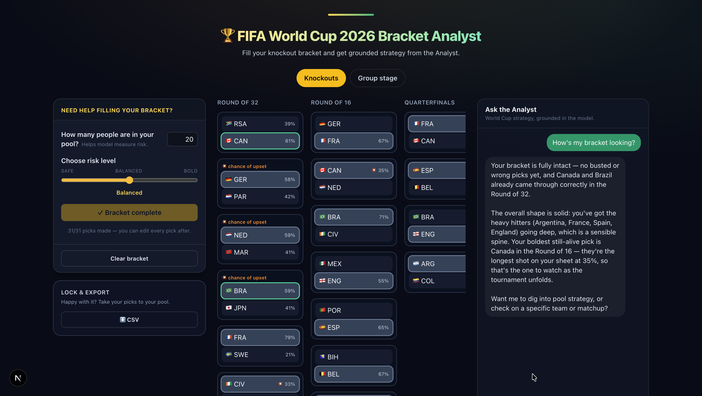
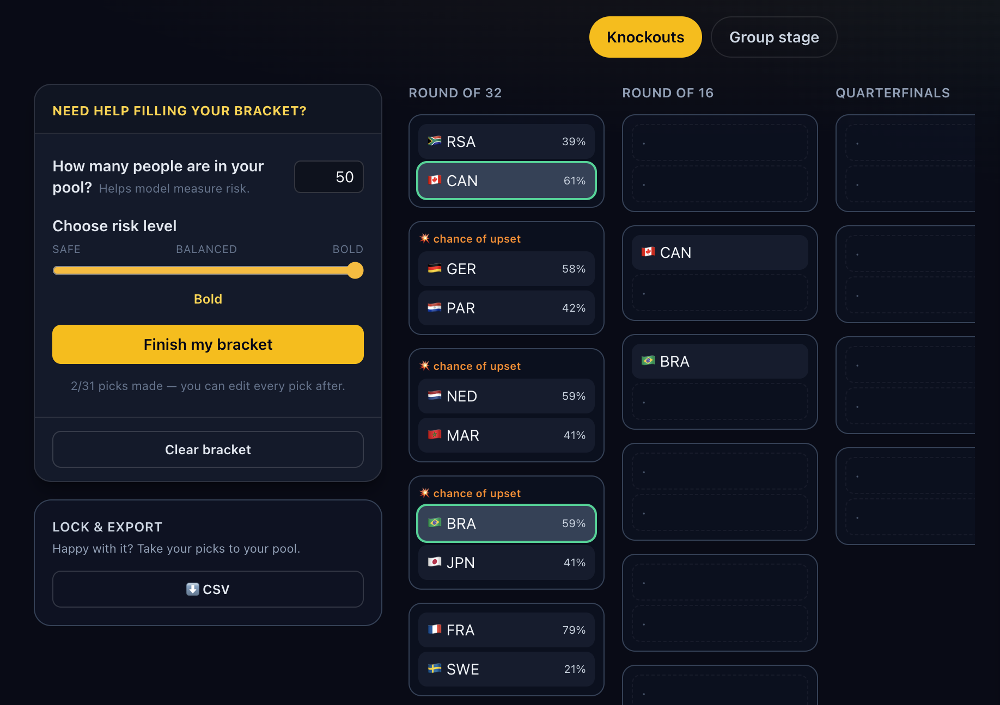
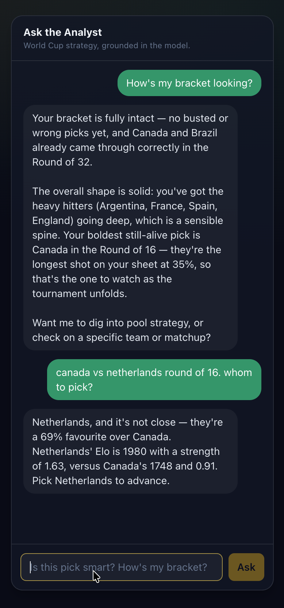
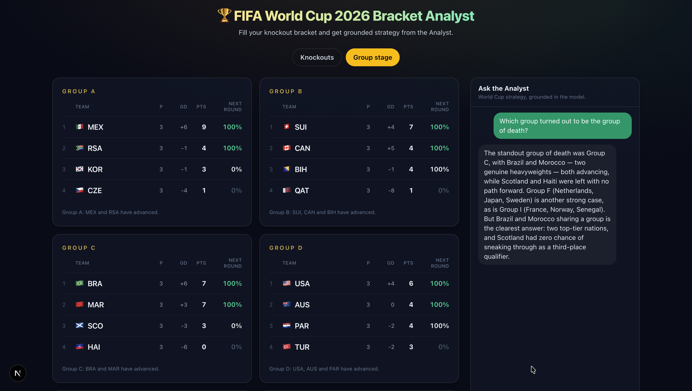
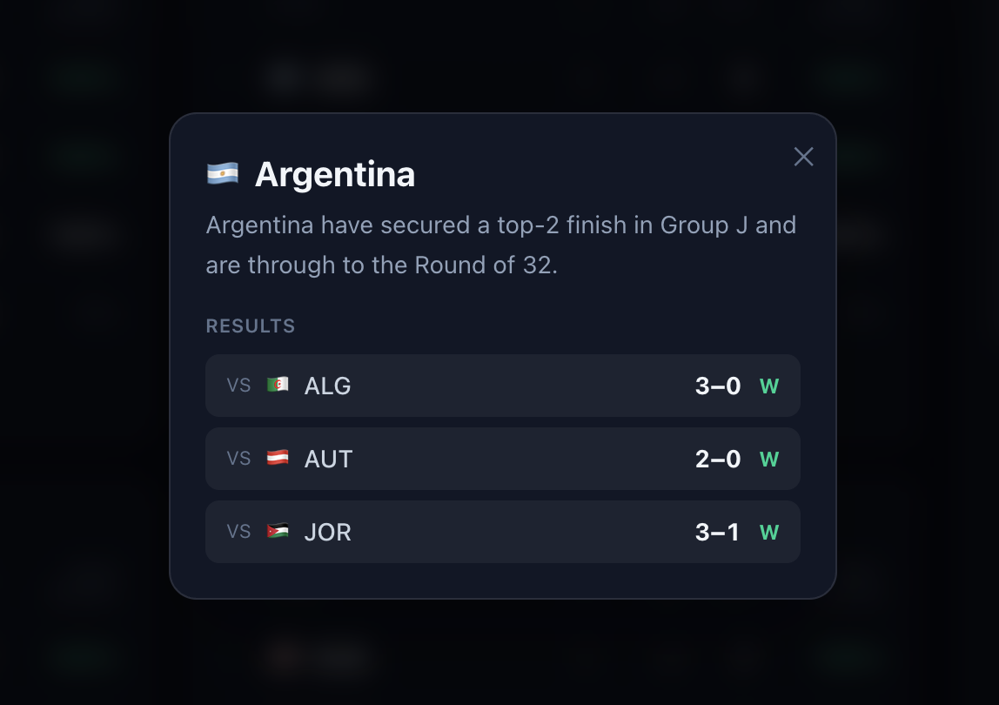

# FIFA World Cup 2026 Bracket Analyst

**Your expert friend for filling out a World Cup bracket pool — and surviving it once the games start.**

Millions of people fill out a World Cup bracket in a pool with friends, family, or coworkers.
Most are casual fans. They don't know who Cape Verde is, they agonize for twenty minutes, they
copy a friend or pick by flag — and they secretly want to beat their group. The Bracket Analyst
is the knowledgeable friend they'd text for advice: it knows every team, runs the numbers, and
gives a straight answer in plain English.

> ⚠️ Unofficial hobby project. It reads FIFA's **undocumented** public JSON endpoints and uses
> **original** styling only (no FIFA logos or imagery). Not affiliated with FIFA.



## Who it's for, and when

A casual bracket player has two moments of need, and the product serves both:

1. **Before the deadline** — *"Help me fill this out without looking clueless (and maybe win)."*
2. **During the tournament** — *"What's happening to my bracket — is it still alive?"*

## What you get

- **Pick guidance.** Every pick shows its real odds, so you can tell at a glance whether a
  favourite is safe or an upset is actually worth the risk — no more agonizing by vibes.
- **Pool-winning strategy — "You vs. the Model."** Winning a *small* pool isn't about raw
  accuracy; it's about **smart differentiation**. The Analyst measures how bold your bracket is
  versus the chalk, weighs the contrarian payoff, and calibrates the risk to your pool size —
  so you stand out enough to win without blowing it up.
- **Grounded expertise, in plain English.** Probabilities come from a real Elo-strength model,
  not opinions. The Analyst explains them like a friend would — and **never makes up a number**;
  if it doesn't have it, it says so.
- **The confusing format, demystified.** The 48-team, best-third-placed, who-plays-whom bracket
  is genuinely hard to read. The app lays out the groups, the path to the Round of 32, and the
  whole knockout tree so you can plan ahead.
- **Live engagement.** Once the games kick off, track your bracket's fate as results land —
  what's still alive, what busted, and how your picks are holding up.

## What it is — and isn't

It's an **advisor**, not a pool host. We don't run pools, store other players' brackets, or own
a leaderboard. You play your pool wherever you already do (an office sheet, ESPN, a group chat);
the Bracket Analyst is the expert you consult to decide your picks and to follow along.

## The app, in three surfaces

- **Bracket Predictor (Knockouts tab).** Fill the knockout bracket yourself, or let the Analyst
  **autofill** a complete, editable one calibrated to your pool size and chosen risk level. Each
  pick shows its head-to-head odds against the opponent it faces; bold underdog picks are
  flagged. When you're happy, lock it and **export to CSV** to copy into your pool.
- **Group dashboard (Group stage tab).** All 12 groups with live-aware standings, each team's
  status (**Through / In contention / 3rd-place race / Out**), and a **Next Round %** for every
  team — including the genuinely hard part no scoreboard shows you: the **8 best third-placed
  teams**.
- **Ask the Analyst.** A chat, available on both tabs, that answers free-form questions —
  *"Is my bracket too safe to win?"*, *"Why are Netherlands favoured?"*, *"NED vs MAR"*,
  *"Who's the top scorer so far?"* — grounded in the same engine the rest of the app uses.

| Autofill with the Analyst | Ask the Analyst |
|---|---|
|  |  |

| Group stage dashboard | Team detail |
|---|---|
|  |  |

## How it works (in one breath)

```
FIFA public JSON ─▶ data (fetch + validate + normalize) ─▶ engine (standings, verdicts,
Elo-strength Monte Carlo, knockout bracket + odds + pool-finish) ─▶ grounding (facts +
plain English) ─▶ the Analyst (grounded LLM chat) ─▶ Next.js UI
```

The engine is pure, framework-agnostic TypeScript and everything it produces is tested; the web
app is a thin shell around it. See **[docs/ARCHITECTURE.md](docs/ARCHITECTURE.md)** for the full
picture, **[docs/DATA.md](docs/DATA.md)** for the data sources, and
**[docs/EVALUATION.md](docs/EVALUATION.md)** for how we keep the numbers and answers honest.

## Quick start

Requirements: **Node 20+**.

```bash
npm install
npm run dev      # http://localhost:3000
```

```bash
npm test         # run the test suite (Vitest)
npm run typecheck
npm run build    # production build
```

### Optional: the conversational Analyst

The app is fully usable with **no API key** — the chat answers with deterministic grounded
"Stats". To get the conversational LLM Analyst instead, add a key:

```bash
# .env.local  (gitignored — never commit it)
ANTHROPIC_API_KEY=sk-ant-...
```

Restart the dev server; the chat upgrades from deterministic "Stats" to the conversational
Analyst (model: `claude-sonnet-4-6`). Get a key at <https://console.anthropic.com/>.

## How it's built

Built **spec-first** with [OpenSpec](https://github.com/Fission-AI/OpenSpec): every behaviour is
described in a spec before it's implemented. The canonical capability specs live in
`openspec/specs/`; the history of changes that produced them is in `openspec/changes/archive/`.

**Tech stack:** TypeScript · Next.js 16 (App Router) · React 19 · Tailwind CSS 4 · Vitest · zod
· `@anthropic-ai/sdk` (`claude-sonnet-4-6`).

## License

Personal project — no license granted yet. Ask before reuse.
