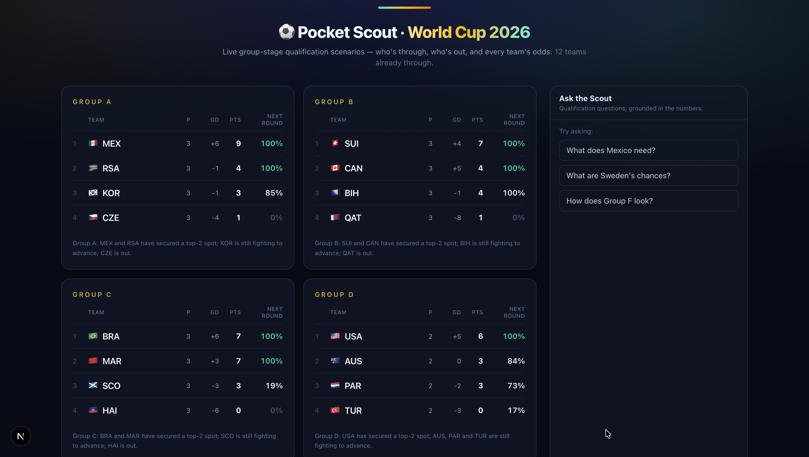
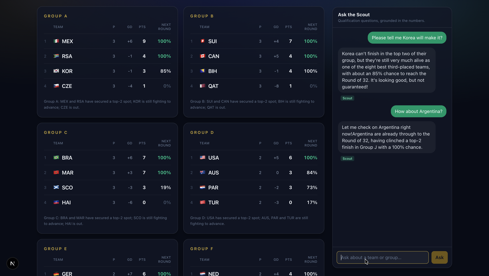
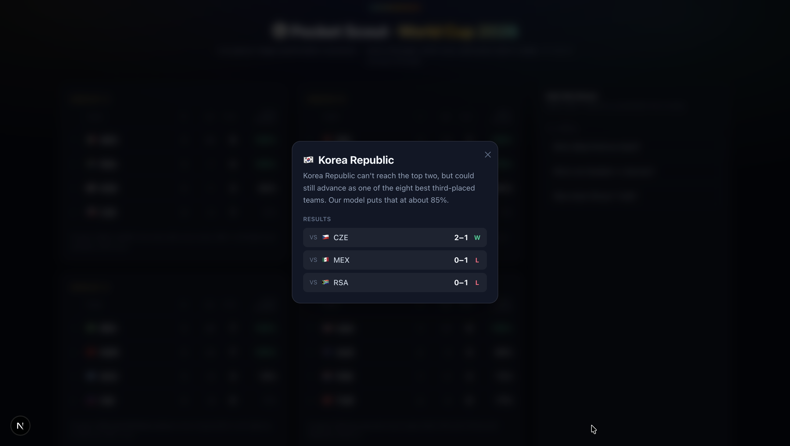

# Pocket Scout — FIFA World Cup 2026

A live **qualification scenario engine** for the FIFA World Cup 2026 group stage, with an AI **Scout** that answers questions in plain English — grounded in the numbers, never made up.

It answers the question every fan asks during the group stage: **"what does my team need to go through?"** — including the genuinely hard part that no scoreboard shows you: the **8 best third-placed teams** across the 12 groups.

> ⚠️ Unofficial hobby project. It reads FIFA's **undocumented** public JSON endpoints and uses **original** styling only (no FIFA logos or imagery). Not affiliated with FIFA.



## What it does

- **Group dashboard** — all 12 groups with standings, each team's status (**Through / In contention / 3rd-place race / Out**), and a **Next Round %** for every team, including clinched (100%) and eliminated (0%).
- **Per-team detail** — click any team for its full name, its World Cup results with full-time scores, and a one-line qualifying status.
- **Ask the Scout** — a chat that answers free-form questions ("What does Mexico need?", "What are Sweden's chances?") grounded in the engine. With an API key it's the conversational LLM Scout; **without a key it still works**, falling back to deterministic grounded "Stats" answers.
- **Live-aware** — while a match is in progress, standings fold the live score ("as it stands"), the odds are conditioned on the current scoreline, and the dashboard auto-refreshes with a 🔴 LIVE badge. When nothing is live, it sits idle (no polling).

## Screenshots

| Ask the Scout | Team detail |
|---|---|
|  |  |

## How it works (in one breath)

```
FIFA public JSON ─▶ data (fetch+validate+normalize) ─▶ engine (standings, verdicts,
Monte Carlo) ─▶ grounding (facts + plain-English) ─▶ Scout (LLM chat) ─▶ Next.js UI
```

The engine is pure, framework-agnostic TypeScript; everything it produces is tested. The web app is a thin shell around it. See **[docs/ARCHITECTURE.md](docs/ARCHITECTURE.md)** for the full picture and **[docs/DATA.md](docs/DATA.md)** for the data sources.

## Quick start

Requirements: **Node 20+**.

```bash
npm install
npm run dev      # http://localhost:3000
```

```bash
npm test         # run the test suite (Vitest)
npm run typecheck
npm run build    # production build
```

### Optional: enable the conversational Scout

The app is fully usable with **no API key** — the chat answers with deterministic grounded "Stats". To get the conversational LLM Scout instead, add a key:

```bash
# .env.local  (gitignored — never commit it)
ANTHROPIC_API_KEY=sk-ant-...
```

Then restart the dev server. The chat's tag flips from grey **Stats** to green **Scout** (model: `claude-sonnet-4-6`). Get a key at <https://console.anthropic.com/>.

## Project structure

```
lib/
  data/        Fetch + cache + zod-validate + normalize the public FIFA JSON → TournamentSnapshot
  engine/      Pure qualification math:
                 standings.ts   FIFA tiebreakers (points → GD → goals → head-to-head → lots)
                 verdict.ts     clinched / alive / eliminated + third-place hand-off
                 scenarios.ts   boundary-margin enumeration of remaining results
                 thirdPlace.ts  best-8-of-12 third-placed selection
                 montecarlo.ts  simulate remaining fixtures (Poisson), live-conditioned
                 probability.ts per-team advancement % (+ win/draw/loss conditional)
                 live.ts        live-match detection
  grounding/   Join engine outputs into per-team/group situations + plain-English narration
  scout/       LLM agent: tools (grounded), prompt, tool-use loop, deterministic fallback
  server/      Cached tournament-data provider (live-aware TTL)
app/
  page.tsx     Server-rendered dashboard
  api/         /api/groups, /api/groups/[id], /api/chat (streaming)
  components/  GroupCard, ScoutChat, TeamButton, LiveRefresher, flags, teamResults
openspec/      Spec-driven development: canonical specs/ + archived changes/
```

## Tech stack

TypeScript · Next.js 16 (App Router) · React 19 · Tailwind CSS 4 · Vitest · zod · `@anthropic-ai/sdk` (`claude-sonnet-4-6`).

## Development model

This project is built **spec-first** with [OpenSpec](https://github.com/Fission-AI/OpenSpec): every behavior is described in a spec before it's implemented. The canonical capability specs live in `openspec/specs/`; the history of changes that produced them is in `openspec/changes/archive/`.

## Testing notes

- The suite is mostly pure unit tests over a committed data snapshot (`lib/data/__fixtures__/`).
- A **live data smoke test** hits the real FIFA endpoints — set `SKIP_LIVE=1` to skip it offline.
- A **live Scout smoke test** runs only when `ANTHROPIC_API_KEY` is set; otherwise it's skipped.

## License

Personal project — no license granted yet. Ask before reuse.
